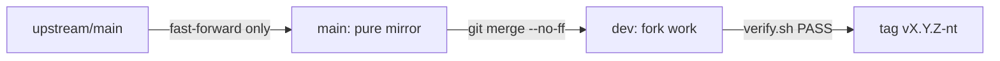

# No-Telemetry Guidelines

## TL;DR

This fork of `alibaba/open-code-review` may contact **only** the configured inference server and the MCP servers the user configured. Every other path is mocked or compiled out. After each upstream merge, run `scripts/no-telemetry/verify.sh`. It must print `PASS`.

## Policy

| Rule | Enforced by |
|---|---|
| No telemetry SDK or exporter in the binary | Build-tag shim (A) + verify check 2 |
| Only the inference server and user-configured MCP servers are contacted at runtime | verify check 4 (strace) |
| No self-update, no registry lookups | Launcher and `update.js` hooks (D) |
| No third-party assets on the website | Self-hosted fonts and icons (D) |
| The GitHub Action makes no GitHub API calls | `if: false` hooks in `action.yml` (D) |
| Credential files never reach the model | Secret guard in LLM tools (C) |
| Privacy wins over matching upstream exactly | Merge rules below |

### Allowed egress

| Destination | When |
|---|---|
| Configured LLM endpoint (config, `OCR_LLM_*`, `ANTHROPIC_*`, shell rc) | Every review |
| User-configured MCP servers (`mcp_servers` in `~/.opencodereview/config.json`) | `ocr review`, only if configured |
| AWS Bedrock runtime + STS/SSO (credential chain, IMDS **disabled**) | Only with protocol `anthropic-bedrock` |
| Loopback (viewer, fake LLM in tests) | Always |

There is no web-search or fetch tool. If upstream adds one, it may stay only after review and only as an explicit tool call.

## Patch techniques

Use the first technique that works. Each step down this list means more merge conflicts.

| # | Technique | Upstream lines touched | Example |
|---|---|---|---|
| 1 | **Fork-owned file** (`*_notelemetry.go`, `scripts/no-telemetry/*`) | 0 | `cmd/opencodereview/notelemetry_init.go` |
| 2 | **Build-tag exclusion** of an upstream file + fork-owned replacement | 3, in the header | `internal/telemetry/provider.go` |
| 3 | **One-line hook** calling a fork-owned helper | 1–3 | `addr = loopbackOnly(addr)` |
| 4 | In-place edit | any | Last resort, document why |

Every line added to an upstream file carries the tag `[no-telemetry fork]` and is counted in `scripts/no-telemetry/markers.txt`.

```go
// Technique 2: header added to an upstream file
// SPDX-License-Identifier: Apache-2.0
// Copyright 2026 alibaba/open-code-review Contributors

// [no-telemetry fork] OTel SDK/exporter code compiled out; see noop_notelemetry.go.
//go:build ignore
```

## Patch inventory

### A. Telemetry

| File | Technique | What |
|---|---|---|
| `internal/telemetry/{exporter,provider}.go` + their `_test.go` | 2 | SDK, OTLP and stdout exporters excluded from the build |
| `internal/telemetry/noop_notelemetry.go` | 1 | Same API: `Init` → false, prints a notice if telemetry was requested; provider vars typed as API interfaces |
| `cmd/opencodereview/main_test.go` | 2 | Upstream "telemetry flushed" test excluded; inverse in `notelemetry_test.go` |

The 148 call sites stay untouched. They use only the OTel **API** packages, which have no network code and default to no-op providers.

### B. Process environment (`cmd/opencodereview/notelemetry_init.go`)

| Variable | Value | Blocks |
|---|---|---|
| `AWS_EC2_METADATA_DISABLED` | `true` | AWS SDK fallback to 169.254.169.254 |
| `GIT_NO_LAZY_FETCH` | `1` | git fetching missing objects from the promisor remote (partial clones) |
| `GIT_TERMINAL_PROMPT` | `0` | git credential prompts |
| `OTEL_EXPORTER_*`, `OTEL_{TRACES,METRICS,LOGS}_EXPORTER` | unset | Exporter config leaking to child processes |
| `Version` | `+ "-no-telemetry"` | Shown in `ocr version`, SARIF and User-Agent |

Child processes (git, MCP stdio servers, `api_key_cmd`) inherit these settings, which also covers code that calls `exec` directly.

### C. Hooks into fork-owned helpers

| Hook (upstream file) | Helper | Effect |
|---|---|---|
| `internal/viewer/server.go` `StartServer` | `loopback_notelemetry.go` | Viewer listens on loopback only; a wildcard or external `--addr` becomes `127.0.0.1:<port>` |
| `internal/tool/filereader.go` `Read`, `ReadLines` | `secret_notelemetry.go` | `file_read` refuses `.env`, `id_rsa`, `.netrc`, … |
| `internal/tool/code_search.go` result loop | same | Secret files dropped from `code_search` |
| `internal/tool/file_find.go` file list | same | Secret files dropped from `file_find` |

The secret patterns come from upstream's `internal/config/allowlist/default_secret_patterns.json`. This fix is generic; upstreaming it would remove a fork patch.

### D. JavaScript, website, CI

| File | Patch |
|---|---|
| `bin/ocr.js` | `process.env.OCR_NO_UPDATE = "1"`: no registry check, no `npm i -g` |
| `scripts/update.js` | `process.exit(0)` at the top (second guard) |
| `pages/index.html` | Fonts and Font Awesome come from `/self-hosted/…`; preconnects to Google removed |
| `pages/public/self-hosted/` | Generated by `scripts/no-telemetry/self-host-web-assets.sh` (commit the output) |
| `pages/src/hooks/useNpmDownloads.ts` | Returns before `fetch(api.npmjs.org)` |
| `pages/src/index.html.test.ts` | Asserts the self-hosted URL instead of Google Fonts |
| `action.yml` | Checkpoint lookup and comment posting `if: false`; `upload_artifacts` default `'false'`; `OCR_NO_UPDATE=1` exported for every step |
| `scripts/verify-license.sh`, `scripts/add-license.sh` | `self-hosted/` ignored: third-party font/icon CSS keeps its own license, no Apache header |
| `AGENTS.md` | Points AI agents to this file |

Upstream `.github/workflows/*` are left unedited. **Disable GitHub Actions** for the publish and Pages-deploy workflows in the fork's repository settings.

### Kept as upstream, on purpose

| Item | Reason |
|---|---|
| `install.sh`, `install.ps1`, npm `postinstall`, VS Code / JetBrains "Install" buttons | User-initiated, checksum-verified. ⚠️ They install the **upstream** binary, so only `make build` from `dev` gives the fork's protections |
| Fallback to `ANTHROPIC_*` env and shell rc files | Still points at an inference server |
| MCP client | User-configured only; no default servers are shipped |
| JetBrains plugin (`extensions/idea`) and shared webview (`extensions/frontend`) | Audited on the merge that brought them in: they only spawn `ocr`/git/npm locally, inline their webview bundle, and register no usage collectors or error reporters |
| Local session and raw logs in `~/.opencodereview/` | Local only, `0600`/`0700` permissions, credential headers redacted |

## Branches and merge procedure



```bash
git remote add upstream https://github.com/alibaba/open-code-review.git   # once
git fetch upstream --tags
git checkout main && git merge --ff-only upstream/main && git push origin main
git checkout dev  && git merge --no-ff main
```

### Conflict rules

| Conflict in | Resolution |
|---|---|
| A tagged hook line | Take upstream's change, then re-apply the hook on top; keep the tag |
| A build-tag-excluded file | Take upstream's body (`--theirs`) and keep the 3-line `//go:build ignore` header |
| `go.mod` / `go.sum` | Take upstream's version, then run `make check` (it runs `go mod tidy` and drops the exporters again) |
| Shim fails to compile (`undefined: telemetry.X`) | Upstream added API: add a no-op `X` to `noop_notelemetry.go` and never re-enable the SDK |
| Need to test something mid-merge | **Never `git stash` during a merge**: it drops `MERGE_HEAD`. Commit the merge first, or use a separate worktree |
| Anything that would re-introduce egress | **Privacy wins.** Mock it with technique 1–3, even if that diverges from upstream |

## Post-merge checklist

| # | Command / check | Pass if |
|---|---|---|
| 1 | `make check` | Clean (format, tidy, license, English) |
| 2 | `make test` | All green |
| 3 | `make coverage` | ≥ 90% |
| 4 | `npm run test:launcher && npm run test:update && npm run test:github-actions` | All green |
| 5 | `cd pages && npx vitest run && npm run build` | Green; `grep -rE 'googleapis\|gstatic\|cdnjs' dist` is empty |
| 6 | `scripts/no-telemetry/verify.sh` | Prints `PASS`, exit 0 |
| 7 | Audit the merge diff (below) | Nothing new left unreviewed |

### Auditing new upstream code

| Look for | Command |
|---|---|
| New dependencies | `git diff ORIG_HEAD -- go.mod '**/package.json'` |
| New network APIs | `git diff ORIG_HEAD -- '*.go' '*.js' '*.ts' \| grep -E '^\+.*(http\.(Get\|Post\|NewRequest\|Client)\|net\.Dial\|fetch\(\|https\.request\|grpc\.)'` |
| New subprocesses | `git diff ORIG_HEAD \| grep -E '^\+.*(exec\.Command\|spawn\(\|spawnSync\()'` |
| New LLM tools | `git diff ORIG_HEAD -- internal/tool/definitions.go` |
| New hosts | verify check 3 lists them; add each to `known-hosts.txt` with a category, or mock it |

## `verify.sh`: what it proves

| Check | Fails when | File it reads |
|---|---|---|
| 1 Markers | Count of tags per file differs | `markers.txt` |
| 2 Linked deps | `go list -deps` contains `otel/sdk`, `otel/exporters` or `grpc` | — |
| 3 Hosts | A host literal in runtime code is not reviewed | `known-hosts.txt` |
| 4 Runtime | Under `strace -f`, `ocr version` opens any socket, or `ocr review` (with telemetry requested) contacts anything but the fake LLM, or `.env` content goes out | `fakellm.go` |
| 5 Self-test | A probe to `egress-selftest.invalid` is **not** flagged (exit 2: the detector is broken) | — |

A trace only covers the code that actually ran. Checks 1–3 and the audit table cover the rest. `--static-only` skips 4–5 where strace is unavailable; never tag a release from a static-only run.

## Release

| Step | Command |
|---|---|
| 1 | Merge and pass the checklist above |
| 2 | `git tag -a vX.Y.Z-nt -m "vX.Y.Z no-telemetry"` (X.Y.Z = upstream version merged) |
| 3 | `make dist VERSION=vX.Y.Z` (the binary reports `vX.Y.Z-no-telemetry`) |
| 4 | Publish the binaries from the fork's own releases; never push to the upstream npm package |

## Commits

| Rule | Source |
|---|---|
| Small, English, LF line endings | `AGENTS.md` |
| A change to a hook updates `markers.txt` in the same commit | this file |
| No AI attribution trailers | `AGENTS.md` rule 6 |
